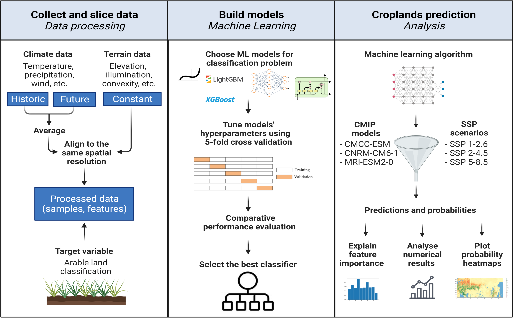

# ArableLandSuitability
This repository contains machine learning models for estimating cropland types (irrigated, non-irrigated, no crop) to assess climate change impact on agricultural land suitability across various carbon emission scenarios.

The methodology consists of a three-stage workflow: data acquisition and preprocessing, training of machine learning models, and result evaluation through the prediction of cropland distribution based on different climate models and SSP scenarios. This workflow yields robust results, leverages historical data, and is capable of simulating the distribution of cropland types under future climate projections. For details, see https://ieeexplore.ieee.org/document/10415007



## Dependencies

* Dependencies are listed in requirements.txt file.

## Data

The data required for the project is available in the `data` folder. The folder contains various files in the formats of .tif and .npy. The data has been preprocessed and stored in these files.

The project directory structure should be organized as follows (tree depth is limited by 2):
``` bash
.
|-- Dockerfile
|-- README.md
|-- data
|   |-- climate_data
|   |-- geo_data
|   |-- npys_data
|   |-- processed_files
|   `-- target
|-- data_processing
|   |-- aggregate_ssps.py
|   |-- climate_analysis.ipynb
|   |-- data_preprocessing.ipynb
|   |-- data_processing.ipynb
|   |-- GFSAD_heatmaps.ipynb
|   |-- plot_feature_importance.ipynb
|   |-- plot_predicted_croplands.ipynb
|   |-- save_processed_dataset.ipynb
|   `-- target_variable.ipynb
|-- environments
|   |-- drun.sh
|   `-- requirements.txt
|-- models
|   |-- feature_importance
|   |-- catboost_clf.py
|   |-- conv_lstm_pl.py
|   |-- lstm_pl.py
|   |-- mlp_pl.py
|   |-- ml_models_croplands.py
|   |-- transformer_pl.py
|   |-- meta_model.ipynb
|   |-- models_test_metrics.ipynb
|   `-- predictions.py
|-- results
|   |-- 2022_2032
|   |-- 2040_2050
|   |-- feature_importance
|   |-- pickle_models
|   `-- prob_subs
`-- src
    |-- dataprocessing.py
    |-- evaluation.py
    |-- model_utils.py
    |-- prepare_target.py
    `-- preprocessing.py
```

The data covers the following time periods:
* ERA5 climate data is available from 1979 to 2022.
* Future climate data is available for the years 2020 to 2050, with three different CMIP6 simulations (SSP1-2.6, SSP2-4.5, and SSP5-8.5) from CNRM-CM6-1, CMCC-ESM2, and MRI-ESM2-0.
* Crop mask data is available for the nominal year 2010.

## Docker

To set up the project using Docker, follow these steps:

* Build the Docker image: `docker build -t crop_dev .`
* Run the Docker container: `docker run -it  -v  <CODE FOLDER>:/crop -v <DATA FOLDER>:/crop/data -m 16000m  --cpus=4  -w="/crop" crop_dev`

## Executing program
The program consists of several steps, including data processing, building models, forecasting, and processing the results. Here's an overview of the notebooks and scripts available for each step:

### Data processing
The data has already been preprocessed and stored in the `data` folder. However, if you need to process data for different time periods, you can use the following notebooks:

1. [data_preprocessing.ipynb](https://github.com/makboard/ArableLandSuitability/blob/main/data_processing/data_preprocessing.ipynb): 
This notebook loads data for specific periods and areas of interest, aligns spatial resolution, and averages data for the same calendar month over multiple years.
2. [target_variable.ipynb](https://github.com/makboard/ArableLandSuitability/blob/main/data_processing/target_variable.ipynb):
This notebook resamples the GFSAD crop mask data to match the spatial resolution of the features, crops the GFSAD crop mask to the area of interest, and optionally creates an extended landcover map using the [Landcover dataset](https://developers.google.com/earth-engine/datasets/catalog/MODIS_061_MCD12Q1) and crop mask.
3. [data_processing.ipynb](https://github.com/makboard/ArableLandSuitability/blob/main/data_processing/data_processing.ipynb):
This notebook reshapes the preprocessed data to the shape (num_samples, num_features) and stores it as ready-to-use .npy files in the intended directory.
4. [save_processed_dataset.ipynb](https://github.com/makboard/ArableLandSuitability/blob/main/data_processing/save_processed_dataset.ipynb):
This notebook downsamples the features and target variable and stores them as .pkl files for further use in model building. It also reshapes the features for the LSTM model and stores them as .pkl files.

### Building models
The next step is to build models based on the processed data and store them for reuse. The following notebooks/scripts are available for this step:

1. [ml_models_croplands.py](https://github.com/makboard/ArableLandSuitability/blob/main/models/ml_models_croplands.py):
This script trains Logistic Regression, XGBoost, and LightGBM classification models using RandomizedSearchCV and CalibratedClassifierCV in a pipeline. It saves the models with the best parameters in the `results` folder.
2. [lstm_pl.py](https://github.com/makboard/ArableLandSuitability/blob/main/models/lstm_pl.py):
This py file trains an LSTM classification model using a predefined LightningDataModule and LightningModule. It is used to tune the hyperparameters of the LSTM nn.Module using a validation dataset and saves the final model in the `results` folder. The same structure is organized for other neural networks.
3. [models_test_metrics.ipynb](https://github.com/makboard/ArableLandSuitability/blob/main/models/models_test_metrics.ipynb):
This notebook evaluates all the final models on the test set using various metrics to select the best model for further experiments. It includes a classification report (Sklearn), confusion matrix, precision-recall curve, ROC curve, OvR ROC AUC scores and plots, and OvO ROC AUC scores and plots.

### Forecasting and processing results
After building the models, the next step is to forecast cropland distribution using the selected model and analyze the results. The following notebooks/scripts are available for this step:

1. [predictions.py](https://github.com/makboard/ArableLandSuitability/blob/main/models/predictions.py):
This script generates predictions based on different future climate scenarios and stores the results in .npy files in the `results` folder.
2. [GFSAD_heatmaps.ipynb](https://github.com/makboard/ArableLandSuitability/blob/main/data_processing/GFSAD_heatmaps.ipynb):
This notebook reshapes the predicted array based on the initial latitude and longitude of the area and filters it using a water map and mountain map, as cropland cannot occur in those areas. It plots heatmaps of the probabilities difference between the initial GFSAD map and the predicted future cropland probabilities by a model and stores the plots in the `results` folder.
3. [plot_predicted_croplands.ipynb](https://github.com/makboard/ArableLandSuitability/blob/main/data_processing/plot_predicted_croplands.ipynb):
This notebook collects cropland class distributions in different time periods and climate scenarios and plots curves for each class and climate scenario to visualize the difference in forecasts.
4. [feature_importances_lstm.py](https://github.com/makboard/ArableLandSuitability/blob/main/models/feature_importance/feature_importance.py):
This script computes global feature importance using Permutation Feature Importance and stores a plot of the top feature importance in the `results` folder.
5. [feature_analysis_local_lstm.py](https://github.com/makboard/ArableLandSuitability/blob/main/data_processing/feature_analysis_local_lstm.py):
This script computes local feature importance for the LSTM model using Integrated Gradients for selected areas of interest and stores a plot of the top 10 local specific feature importance in the `results` folder.

[src](https://github.com/makboard/ArableLandSuitability/blob/main/src) folder contains `preprocessing.py`, `evaluation.py`, `dataprocessing.py`, `prepare_target.py` and `model_utils.py` modules for processing data, auxiliary procedures, building models, and plotting results.

Please note that you should follow the instructions in the readme file regarding the organization of the project directory and the necessary dependencies.


## Contributing

Please let us know if you encounter a bug or have any suggestions by [filing an issue](https://github.com/makboard/ArableLandSuitability/issues).

We welcome all contributions from bug fixes to new features and extensions.

We expect all contributions discussed in the issue tracker and going through PRs.


## Cite
If you find this work usefull, please cite the following paper:

```bibtex
@article{shevchenko2024climate,
  title={Climate Change Impact on Agricultural Land Suitability: An Interpretable Machine Learning-Based Eurasia Case Study},
  author={Shevchenko, Valeriy and Lukashevich, Aleksandr and Taniushkina, Daria and Bulkin, Aleksandr and Grinis, Roland and Kovalev, Kirill and Narozhnaia, Veronika and Sotiriadi, Nazar and Krenke, Alexander and Maximov, Yury},
  journal={IEEE Access},
  year={2024},
  publisher={IEEE}
}
```
